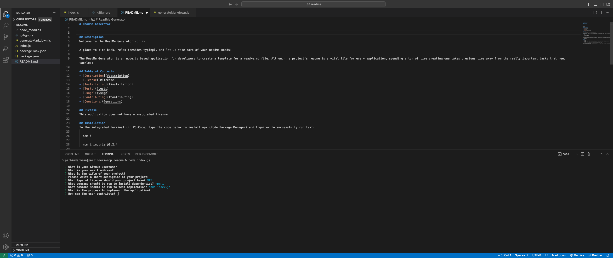

  # ReadMe Generator
  

  ## Description
  Welcome to the ReadMe Generator! 
  
  A place to kick back, relax (besides typing), and let us take care of your ReadMe needs!  

  The ReadMe Generator is an node.js based application for developers to create a template for a readMe.md file. Although, a project's readme is a vital file for every application, spending a ton of time creating one takes precious time away from the really important tasks that need tackled!

  ## Table of Contents
  - [Description](#description)
  - [License](#license)
  - [Installation](#installation)
  - [Tests](#tests)
  - [Usage](#usage)
  - [Contributing](#contributing)
  - [Questions](#questions)

  ## License 
  This application does not have a associated license.

  ## Installation
  In the integrated terminal (in VS.Code) type the code below to install npm (Node Package Manager) and Inquirer to successfully run test.

    npm i
    
    npm i inqurier@8.2.4
  

  ## Tests 
  To run and test the ReadMe Generator, enter the code below, after installing the above code block reference in the Installation section.

    node index.js

  ## Usage
  Once the ReadMe Generator is initiated, the user will be prompted with a series of questions that will be aimed at information regarding the sections in a readme file. The user will encounter questions with two different types of answer inputs:  
  - Text Input
    - Ex: "What is your GitHub username?" is looking for a text input from the user, and this should only hold one answer.
  - List Input
    - Ex: "What type of license should your project have?" is going to display options of licenses for the user to choose from that are commonly used. To choose which license the application requires, use the arrow keys on a keyboard to channel through the options. After hovering over the one that is correct, press the 'Enter" key and the next question will appear.

  Some questions will have a default value set for the answer. If the default value is of the user's liking, they can just hit enter and the default value will store as the users input. If the value is not representative of the correct answer, the user may just type the input they would like to display on their readme.

  
  

  ## Contributing 

  KU Bootcamp

  ## Questions
  
  Have More Questions?!

  Email me here: parbinder25@gmail.com
  